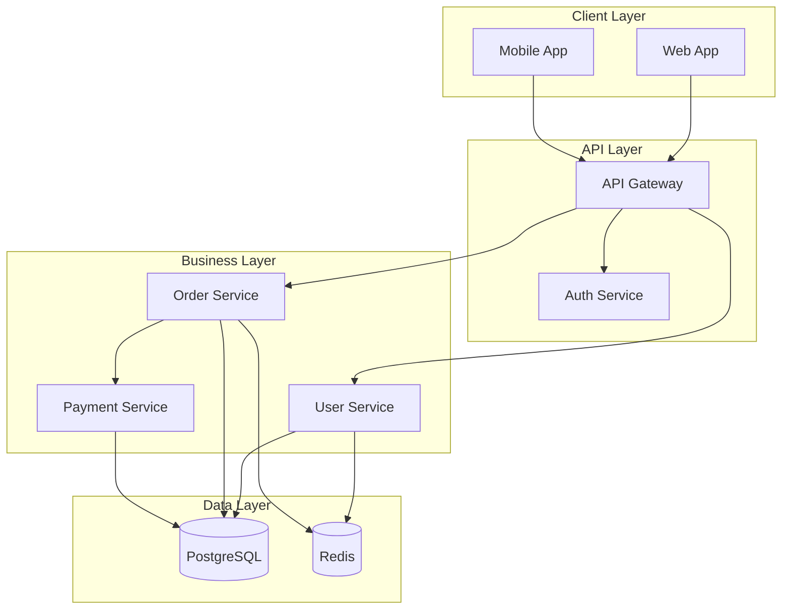

## PHASE 3: System Architecture (15-20 min)

> **Order for this phase:** 3.1 → 3.2 → 3.3 → 3.4 → 3.5 → 3.6 → 3.7 → 3.8 → 3.9 → 3.10 → 3.11 → 3.12

> **📌 Scope-based behavior:**
>
> - **MVP:** Ask 3.1-3.6 (tech stack essentials) and 3.12 (API structure), skip 3.7-3.11 (advanced features), mark as "TBD"
> - **Production-Ready:** Ask all questions 3.1-3.12
> - **Enterprise:** Ask all questions 3.1-3.12 with emphasis on scalability and integrations

> **📌 Note:** If Phase 0 detected framework/language/dependencies, those will be pre-filled. Review and confirm.

### Objective

Define the technical stack, architecture patterns, and system design.

> **Note:** At the end of this phase, the AI will automatically generate a system architecture diagram in mermaid format, based on your answers. This diagram will be included in the docs/architecture.md document.

---

## 🔍 Pre-Flight Check (Smart Skip Logic)

**Execute Pre-Flight Check for Phase 3:**

- **Target File**: `docs/architecture.md`
- **Phase Name**: "SYSTEM ARCHITECTURE"
- **Key Items**: Framework, architecture pattern, API style, database, caching, background jobs, integrations
- **Typical Gaps**: API versioning, rate limiting, caching strategy

**Proceed with appropriate scenario based on audit data from `.ai-flow/cache/audit-data.json`**

---

## Phase 3 Questions (Full Mode)

---

#### 🎨 MERMAID ARCHITECTURE DIAGRAM FORMAT - CRITICAL

> 📎 **Reference:** See [prompts/shared/mermaid-guidelines.md](../../.ai-flow/prompts/shared/mermaid-guidelines.md) for architecture diagram syntax, node shapes, and styling.

**Example Architecture Diagram:**



**Best Practices:**

- Group related components using `subgraph`
- Show external services (Email, SMS, Payment gateways)
- Include monitoring and logging components
- Label protocols on connections (HTTPS, gRPC, WebSocket)
- Use consistent naming conventions

## **Validation:** Preview at https://mermaid.live/ before committing

---

<!-- ============================================================ -->
<!-- 3.1 — FRAMEWORK (conditional by project type)               -->
<!-- ============================================================ -->

**3.1 Framework**

```
[If detected from Phase 0, show:]
✅ Framework Detected: [framework]
✅ Language: [language + version]
✅ Runtime: [runtime]

Is this correct? (Y/N)
If no, please specify the correct framework and language.

[If NOT detected, ask based on PROJECT_TYPE:]
```

> Use the correct option list for your PROJECT_TYPE:

**[BACKEND & FULLSTACK — 3.1 options]**

```
Which backend framework will you use?

Node.js (JavaScript):
A) 🔥 Express.js - Popular (minimal, flexible, lightweight)
B) Hapi.js - Enterprise (configuration-driven)

TypeScript (Node.js):
C) ⭐ NestJS - Recommended (structured, enterprise-ready, decorators)
D) ⚡ Fastify - Modern (high performance, schema validation)

Python:
E) ⭐ FastAPI - Recommended (modern, fast, auto-docs)
F) 🔥 Django - Popular (batteries included, admin panel)
G) Flask - Minimal (micro-framework, flexible)

Java:
H) 🏆 Spring Boot - Enterprise standard
I) Quarkus - Modern (cloud-native, fast startup)

Java (NetBeans - Ant Based):
J) ⚡ NetBeans + Servlets/JSP - Traditional Java web
K) 🔥 NetBeans + JAX-RS - RESTful API
L) 🏆 NetBeans + Spring Framework (Ant)

Java (Eclipse - Maven/Gradle):
M) 🏆 Eclipse + Spring Boot (Maven/Gradle)

Go:
N) ⚡ Gin - Popular (fast, minimalist)
O) Echo - Feature-rich (middleware, routing)
P) Fiber - Express-like (high performance)

Rust:
Q) ⚡ Actix-web - High performance (async, type-safe)
R) Rocket - Developer-friendly (macros, type-safe)

Kotlin:
S) Ktor - Native Kotlin (coroutines, DSL)
T) Spring Boot - Java interop (Kotlin support)

Other:
U) Ruby (Rails)
V) PHP (Laravel)
W) C# (.NET Core)

Your choice: __
Why?
```

**[FRONTEND — 3.1 options]**

```
Which frontend framework will you use?

React ecosystem:
A) ⭐ React + Vite - Recommended (fast, flexible)
B) 🔥 Next.js - Popular (SSR/SSG, full-stack capable)
C) Remix - Modern (full-stack, web standards)

Vue ecosystem:
D) Vue.js + Vite - Progressive, approachable
E) Nuxt.js - SSR/SSG for Vue

Angular:
F) Angular - Enterprise (opinionated, batteries included)

Svelte ecosystem:
G) SvelteKit - Modern (compiler-based, fast)
H) Svelte - Minimal (no framework overhead)

Other:
I) Solid.js - Fine-grained reactivity
J) Astro - Content-focused (MPA + islands)
K) Ember.js - Convention-over-configuration
L) Other: __

Your choice: __
Why?
```

**[MOBILE — 3.1 options]**

```
Which mobile framework will you use?

Cross-platform:
A) ⭐ React Native - Recommended (JS/TS, large ecosystem)
B) 🔥 Flutter - Popular (Dart, high performance, single codebase)
C) Expo (React Native) - Managed workflow, easy start

Native:
D) iOS — Swift + SwiftUI / UIKit
E) Android — Kotlin + Jetpack Compose / XML layouts
F) Both native (separate iOS + Android codebases)

Other:
G) Ionic - Web tech (Angular/React/Vue) + Capacitor
H) .NET MAUI - C# cross-platform
I) Other: __

Your choice: __
Why?
```

---

**3.2 Language & Version**

```
Primary programming language and version:

Language: **
Version: ** (e.g., Node 20, Python 3.11, Java 21, Dart 3.x)

Type system:
A) ⭐ Strongly typed - TypeScript, Java, Go, Dart (Recommended for large projects)
B) Dynamically typed - JavaScript, Python, Ruby
C) Gradually typed - Python with type hints

Package Manager:
A) ⭐ npm - Standard, comes with Node
B) 🔥 pnpm - Fast, disk efficient
C) ⚡ yarn - Popular alternative
D) 🚀 bun - Ultra fast (if using Bun runtime)
E) 🐍 pip/poetry (Python)
F) ☕ Maven/Gradle (Java)
G) 🐜 Apache Ant (NetBeans default, Java)
H) pub (Dart/Flutter)
```

**3.3 Architecture Pattern**

```
What architecture pattern will you follow?

A) ⭐ Layered Architecture (Recommended for most projects)
   - Presentation → Business Logic → Data Access
   - Easy to understand and maintain

B) 🏆 Hexagonal/Clean Architecture (Enterprise)
   - Core domain isolated from infrastructure
   - Highly testable and flexible

C) 🔥 MVC (Popular, traditional)
   - Model-View-Controller separation
   - Good for traditional web apps

D) 📦 Modular Monolith (Modern, scalable)
   - Single deployment with independent modules
   - Easier than microservices, more structured than monolith

E) ⚡ Microservices (Modern, complex)
   - Multiple independent services
   - Best for large-scale distributed systems

F) Other: __

Your choice: __
Why this pattern?
```

**3.4 API Style**

```
What API style will you expose? (or consume, for frontend/mobile)

A) ⭐ REST API - Recommended (HTTP/JSON, standard, well-understood)
B) 🔥 GraphQL - Popular (flexible queries, single endpoint)
C) ⚡ gRPC - Modern (high performance, protobuf, microservices)
D) Mixed - REST + GraphQL or REST + gRPC

Your choice: __

API versioning strategy:
A) URL versioning (/v1/users, /v2/users)
B) Header versioning (Accept: application/vnd.api.v1+json)
C) No versioning yet (will add when needed)
```

**3.5 API Reference (Automated)**

```
The AI will automatically generate standard CRUD endpoints for each entity defined in Phase 2.

Please answer the following questions to define the global API conventions (these will apply to all endpoints unless otherwise specified):

**A) Authentication and Access Control**
1. Do all CRUD endpoints require authentication?
  A) ⭐ Yes, all endpoints require authentication (recommended)
  B) Only some (specify which ones)
  C) No authentication required

2. Which roles can access each CRUD operation?
  - GET (list): [admin, manager, user]
  - GET (detail): [admin, manager, user]
  - POST (create): [admin, manager, user]
  - PUT (update): [admin, manager]
  - DELETE (delete): [admin]
  (Standard example: admin, manager, user. Adjust as needed.)

**B) Listing and Filter Conventions**
3. Which pagination scheme do you prefer?
  A) ⭐ offset/limit (recommended)
  B) cursor-based
  C) No pagination

4. Which filter and sorting fields will be supported by default?
  - Filters: [id, name, date, etc.]
  - Sorting: [field, asc/desc]

5. How will filters be passed for GET list endpoints?
  A) ⭐ Query parameters (recommended for simple filters)
  B) POST /search endpoint with body (for complex filters)
  C) Both (query params for simple, POST /search for complex)

6. For POST/PUT/PATCH endpoints, will you use DTOs for request validation?
  A) ⭐ Yes, strict DTOs with validation (recommended)
  B) Accept raw JSON without strict schema

**C) Error and Response Structure**
7. What error response format will be used?
  A) Standard JSON: { "error": "message", "code": 400, "details": {} }
  B) Other (specify)

8. Which fields will be included in the default successful response?
  - data, meta (pagination), links, etc.

**D) Relationships and Expansions**
9. Allow expanding relationships (include/expand)?
  A) ⭐ Yes, support `include` parameter (recommended)
  B) No, flat data only

**E) Custom Endpoint Example**
10. If you want to customize an endpoint, describe here:
---
The AI will use these conventions to document all CRUD endpoints in api.md.
```

**3.5.1 Error Codes Catalog**

```
Will you use standardized error codes?

A) ⭐ Yes - Domain-specific error codes (recommended)
B) No - HTTP status codes only

Format (if yes):
A) ⭐ Prefixed by domain: USER_001, ORDER_003, PAYMENT_005
B) Numeric ranges: 1000-1999 (Users), 2000-2999 (Orders)

Define your error codes table (Code | HTTP | Message | Resolution)
```

**3.5.2 Input Validation Rules Catalog**

```
Define validation rules for common fields across your API:
(email, password, username, phone, url, date, price, quantity, id, slug)

Entity-specific validations:
Entity: __
- field: [rules]
```

**3.5.3 Idempotency Strategy**

```
How will you handle duplicate requests?

A) ⭐ Idempotency keys (Idempotency-Key header + Redis with TTL)
B) Natural idempotency (unique constraints)
C) Not needed

Which endpoints require idempotency? (POST /orders, POST /payments, etc.)
```

**3.6 Key Dependencies**

```
What major libraries/tools will you use?

ORM/Database (backend): TypeORM / Prisma / Sequelize / SQLAlchemy / Hibernate / Other
Validation: class-validator / Joi / Zod / Pydantic / Yup / Other
Authentication: Passport.js / JWT / Auth0/Clerk / Framework built-in

State management (frontend/mobile): Redux / Zustand / Pinia / MobX / Provider / Riverpod / Other
UI library (frontend/mobile): Tailwind / Material UI / shadcn/ui / Ant Design / Other
Testing: Jest / Vitest / Playwright / Flutter Test / Other

Other critical libraries:
-
```

**3.7 Caching Strategy**

```
Will you use caching?

A) ⭐ Redis - Recommended (in-memory, fast, pub/sub)
B) Memcached - Simple key-value cache
C) Application-level - In-process caching
D) Database query cache
E) No caching

If using cache:
- What will be cached? (sessions, query results, computed data)
- Cache invalidation strategy? (TTL, manual, event-driven)
```

**3.8 Background Jobs**

```
Do you need background/async jobs?

A) ⭐ Yes - Using queue system (Bull, BullMQ, Celery, Sidekiq)
B) Yes - Using cron jobs
C) Yes - Using serverless functions
D) No - All operations are synchronous

Job types: email sending, report generation, data processing, cleanup, etc.
```

**3.9 File Storage**

```
How will you handle file uploads/assets?

A) ⭐ Cloud storage - S3, Google Cloud Storage, Azure Blob
B) Local filesystem
C) CDN - Cloudflare, CloudFront, etc.
D) Not needed

If storing files:
- File types: [images, PDFs, videos, etc.]
- Max file size: __ MB
```

**3.10 API Gateway**

```
Will you use an API Gateway?

A) ⭐ Yes - Using API Gateway (Kong, AWS API Gateway, Azure API Management)
B) No - Direct API access

Purpose: [Rate limiting, Authentication, Request routing, Load balancing]
```

**3.11 Real-time Communication**

```
Do you need real-time communication?

A) ⭐ WebSockets - Bidirectional (chat, notifications, live updates)
B) Server-Sent Events (SSE) - Server-to-client streaming
C) Both
D) No - Standard HTTP requests only

Library / use cases / authentication if yes:
```

**3.12 Message Broker** (if background jobs from 3.8)

```
What message broker will you use?

A) ⭐ RabbitMQ - Popular, reliable
B) 🔥 Apache Kafka - High throughput, event streaming
C) ⚡ AWS SQS - Managed, serverless
D) Redis Streams - Simple, fast
E) Other: __

Patterns: Queue / Pub/Sub / Both
Delivery: At-least-once / Exactly-once / At-most-once
Dead letter queue: Yes / No
```

**3.13 API Documentation**

```
How will you document your API?

A) ⭐ Swagger/OpenAPI - Auto-generated from code (code-first)
B) OpenAPI Spec - Write spec first (design-first)
C) Manual Markdown

Your choice: __
```

**3.14 External Integrations**

```
Will you integrate with external services?

💳 Payment: Stripe / PayPal / Square / Mercado Pago / Other
📧 Email: AWS SES / SendGrid / Mailgun / Resend / Other
📱 SMS: Twilio / MessageBird / Other
☁️ Storage: S3 / GCS / Azure / Cloudflare R2 / Other
📊 Analytics: Mixpanel / Amplitude / PostHog / Other
🔍 Monitoring: Sentry / Datadog / New Relic / Other
🔐 Auth provider: Auth0 / Clerk / Supabase Auth / Firebase Auth / Other
🤖 AI/ML: OpenAI / Google Gemini / AWS Bedrock / Other
🗺️ Maps: Google Maps / Mapbox / OpenStreetMap / Other
🔄 Other: GitHub API / Calendar / CRM / Accounting / Other

For each selected, describe the use case:
- Stripe: Process credit card payments for subscriptions
- AWS SES: Transactional emails (order confirmations, password resets)
```

### Phase 3 Output

```
📋 PHASE 3 SUMMARY:

Framework: [name + version]
Language: [name + version]
Architecture: [pattern]
API Style: [REST/GraphQL/gRPC]
API Versioning: [strategy]
Database/Data: [from Phase 2]
Validation: [library]
Auth: [method]
Caching: [strategy]
Background Jobs: [yes/no + method]
File Storage: [strategy]
Real-time: [yes/no + method]
External Services: [list with use cases]

Is this correct? (Yes/No)
```

---

### Generate Phase 3 Documents

**Before starting generation:**

```
📖 Loading context from previous phases...
✅ Re-reading project-brief.md
✅ Re-reading docs/data-model.md (or docs/api-contracts.md)
```

**Generate documents automatically:**

**1. `docs/architecture.md`**

- Use template: `.ai-flow/templates/docs/architecture.template.md`
- Include architecture diagram (mermaid format)

**2. `ai-instructions.md`**

- Use template: `.ai-flow/templates/ai-instructions.template.md`
- Include tech stack, framework, language, key dependencies
- Generate idiomatic code examples following the selected architecture pattern

```
✅ Generated: docs/architecture.md
✅ Generated: ai-instructions.md

📝 Would you like to make any corrections before continuing?
→ If yes: Edit the files and type "ready" when done. I'll re-read them.
→ If no: Type "continue" to proceed to Phase 4.
```

---

> ⚠️ **CRITICAL:** DO NOT generate README.md in this phase. README.md is ONLY generated in Phase 8.

---

## 📝 Generated Documents

After Phase 3, generate/update:

- `docs/architecture.md` - Technical stack and patterns
- `ai-instructions.md` - Instructions for AI agents

---

**Next Phase:** Phase 4 - Security & Authentication (15-20 min)

Next: read phase-4.md from this phases/ directory

---

_Version: 5.0 (Universal — Backend/Frontend/Mobile unified)_
_Last Updated: 2026-03-17_
